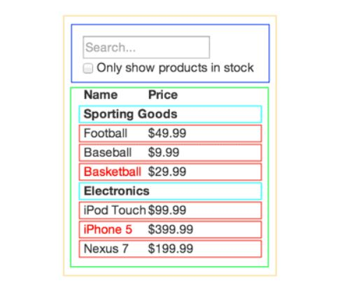

# Thinking in React

## Answering Related Questions

1. How would you break a mock into a component hierarchy?
First we draw boxes around every component and give them all names, then by Using the `single responsibility principle` technique, which is a component should ideally only do one thing.
2. What is the single responsibility principle and how does it apply to components?
It states that every component should ideally only do one thing, we separate our UI into components, where each component matches one piece of data model.
3. What does it mean to build a ‘static’ version of your application?
building a version of our web page that takes data model and renders the UI without any interactivity.
4. Once you have a static application, what do you need to add?
after that we want to add interactivity to our app by implementing the use of states and props.
5. What are the three questions you can ask to determine if something is state?
if the data was passed via props or not? does it change over time? and can we compute it based on any other state.
6. How can you identify where state needs to live?
find a common owner or another component higher up in the hierarchy should own the state. If we can't find one, we can create a new component for the state.

One of many fascinating things in React is it changes the way you think about apps as you build them. Here is the process of building a searchable product data table using React:

1. Break The UI Into A Component Hierarchy

The first thing you’ll want to do is to draw boxes around every component (and subcomponent) and give them all names. 

you should create a new function or object when Using the same techniques for deciding. One such technique is the _single responsibility principle_, that is, a component should ideally only do one thing. If it ends up growing, it should be decomposed into smaller subcomponents.

2. Build A Static Version in React

Now that we have our component hierarchy, now we implement the app. The easiest way is to build a version that takes the data model and renders the UI but has no interactivity. It’s best to decouple these processes because building a static version requires a lot of typing and no thinking, and adding interactivity requires a lot of thinking and not a lot of typing.

To build a static version of your app that renders your data model, you’ll want to build components that reuse other components and pass data using props. props are a way of passing data from parent to child. 

The components will only have render() methods since this is a static version of your app. 

3. Identify The Minimal Representation Of UI State

To make our UI interactive, you need to be able to trigger changes to your underlying data model. React achieves this with __state__.

Ask three questions about each piece of data to distinguish them if they are props or state values:

* Is it passed in from a parent via props? If so, it probably isn’t state.
* Does it remain unchanged over time? If so, it probably isn’t state.
* Can you compute it based on any other state or props in your component? If so, it isn’t state.

4. Identify Where Your State Should Live

React is all about one-way data flow down the component hierarchy. It may not be immediately clear which component should own what state.

For each piece of state in our application:

* Identify every component that renders something based on that state.
* Find a common owner component (a single component above all the components that need the state in the hierarchy).
* Either the common owner or another component higher up in the hierarchy should own the state.
* If you can’t find a component where it makes sense to own the state, create a new component solely for holding the state and add it somewhere in the hierarchy above the common owner component.
